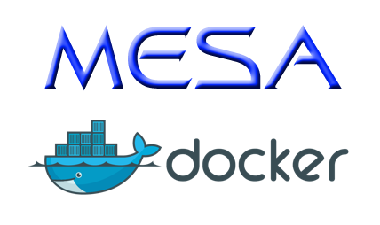

MESA (http://mesa.sourceforge.net/) in a Docker container for easy installation on any modern operating system.

## Intended Use

Installation can be a significant hurdle to those who want to try MESA. 
One solution is MESA-Web (http://mesa-web.asu.edu/), an excellent online interface for basic stellar evolution with MESA. However, MESA-Web does not have the flexibility to offer the full suite of MESA capabilities. This Docker interface is intended to provide an alternative solution by simplifying the requirements for locally running a full MESA installation with all capabilities available, with only minor overhead associated with packaging and running everything inside a container. This should prove especially useful to
* Users trying MESA for the first time
* Students with class projects
* Windows users

This is not intended to replace native installation of MESA for all users, and those who wish to pursue advanced MESA modeling are encouraged to follow the instructions at http://mesa.sourceforge.net/prereqs.html. Some advanced performance features such as rate caching are not available through this Docker interface.

## Prerequisites

At least 8 GB of RAM and 10 GB of free disk space are recommended.
The Docker image is about 5 GB, and you'll also need space to store any MESA output.
If you have < 8 GB of RAM, you may need to tune your Docker settings to allocate an appropriate memory.
If you have ≥ 8 GB of RAM or ≥ 4 CPU cores, you may want to consider tweaking Docker settings to allocate more resources to containers.

###  OS X
Install XQuartz (2.7.10 or newer required). https://www.xquartz.org/

In XQuartz Preferences->Security, check the box for "Allow connections from network clients". Restart XQuartz.

### Windows 10

Install Xming. https://sourceforge.net/projects/xming/

Install Git Bash. https://git-for-windows.github.io/

Running Docker may require enabling VT-x/AMD-v(SVM) in BIOS/UEFI.
I also had to turn off "fast boot" on my particular ASUS motherboard, but I think this is uncommon.

## Install Docker

### OS X, Linux, Windows 10 Pro, Enterprise, and Education

Install Docker Community Edition:
https://www.docker.com/community-edition

### Windows 10 Home (and possibly older Windows versions)

Install Docker Toolbox: https://www.docker.com/products/docker-toolbox

Windows 10 Home does not enable hyper-v, which is required for Docker Community Edition. Docker Toolbox provides a workaround. This is not optimal for performance, but MESA should run.

## Setup

In your terminal, navigate to where you want to set up your MESA working directory, and clone this repository.

	git clone https://github.com/evbauer/MESA-Docker.git

## Starting the Container

The first time you run the script to start the container, Docker will download the 1 GB compressed image and unpack it into a 5GB local image that already has MESA installed. After this, running the script to start and enter the container should be almost instantaneous since Docker caches the local image (Windows 10 Home may be somewhat slower due to the additional overhead of starting a virtual machine).

### OS X

Start Docker.

In your terminal, navigate to your MESA-Docker directory, and run the script for Mac.

	./mac_dockerMESA.sh

### Linux

Navigate to your MESA-Docker directory, and run the script for Linux. The Docker commands in the script require root access (at least on Ubuntu where I've tested this), so you'll need to use `sudo`:

	sudo ./linux_dockerMESA.sh

### Windows 10 (Pro, Enterprise, Education)

Start Docker and Xming.

Open Git Bash and navigate to your MESA-Docker directory, then run the script for Windows.

	./win_dockerMESA.sh

The Windows script currently operates by SSHing into the Docker container for nice handling of X11 forwarding to your desktop. The first time you run this script, the SSH process will warn about the unknown authenticity of the host and ask if you want to continue, so you will need to type `yes` before it will continue the login process. The password for user "docker" is `mesa`. This script also mounts the `docker_work` folder, so the first time it is run you will be prompted to allow Docker to access your hard drive. You will need to agree to that and enter your password to allow access.

### Windows 10 Home (and possibly older Windows versions)

Start Xming.

Open Git Bash and navigate to your MESA-Docker directory, then run the script for Windows Home. Note that if you want the (several GB) virtual machine to be installed on a disk other than your C drive, you'll need to use the `-d` optional argument to specify the drive letter you want. You will then need to consistently use the same drive option whenever you run the script, or edit the script to change the `install_drive=C` line to have the default drive letter match the option from the first time you ran the script.

	./win_home_dockerMESA.sh -d <drive letter>
	
You can leave out the `-d <drive letter>` part of this command if you're happy with the `C` drive as default. The first time this script runs it may take a few minutes to configure the virtual machine.

This script starts a Linux virtual machine, starts the MESA Docker container inside that VM, and then SSH tunnels through both layers into the Docker container with X11 forwarding so you can see your `pgstar` windows.
The first time you run this script, the SSH process will warn about the unknown authenticity of the host and ask if you want to continue, so you will need to type `yes` before it will continue the login process.
Since there are two levels of SSH performed here, you have to enter a password twice. The first password is `tcuser`, and the second password is `mesa`.

## Working in the Container

Assuming the script worked properly in the previous step, your terminal should present you with a bash interface from inside a Docker container with MESA installed and ready to go. Anything you save in the `~/docker_work` directory inside the container will persist in the `MESA-Docker/docker_work` directory outside the container, even after the container is stopped and removed.

To test that everything is working, you might want to follow these steps for a quick first MESA run.

	cd ~/docker_work
	cp -r $MESA_DIR/star/work tutorial
	cd tutorial
	./mk
	./rn	

You should see the `pgstar` windows pop up on your screen and display the evolution of the model. For more info on getting started with MESA now that you have it installed and ready to run, see http://mesa.sourceforge.net/starting.html. 

Since the `~/docker_work` directory is mounted, you can access and edit any of your local working files by navigating to them through the `MESA-Docker/docker_work` folder on your OS. In the above example, you can edit `tutorial/inlist_project` to change the input parameters for the run in your preferred text editor, or open `tutorial/LOGS/history.data` to see some of the output from the run.

Once you've done your work, you can end the session simply by typing

	exit

(Cleanly detaching from the container may require quitting XQuartz/Xming if pgstar windows were used in a MESA run.)

This kills and deletes the container instance in which you were running MESA, leaving only the files you saved in the `~/docker_work` directory and its children. However, Docker caches the image after the first time you download it, so you can easily start up in a completely fresh container simply by running the script again, and you'll still be able to start right back up where you left off with anything saved in `~/docker_work`. You can even restart from a photo of a run you've previously done:

	cd ~/docker_work/tutorial
	./re x200

## MESA Version Control

New containers should be built soon after there is an official release announcement. If all you want to do is upgrade to the latest MESA release, you should be able to do so by running the scripts as usual after executing

	git pull

in the MESA-Docker repository.

If you want to run with a MESA version other than the latest public release, use the optional argument `-v` along with one of the supported version numbers:
* 10108 (latest)
* 10000
* 9793

For example, if you want to run version 9793 on Windows instead of the latest public release, just execute

	./win_dockerMESA.sh -v 9793

## Removing MESA-Docker

Docker will automatically cache the 5 GB image the first time you call the script, so you won't have to download it every time you run. If you no longer use MESA-Docker and want to free up that space on your hard drive, you can see a list of all your cached images by typing

	docker images

This will show you all the images and how much space they are taking up. You should be able to remove the MESA-Docker image with the command

	docker rmi evbauer/mesa_lean:10108.01

### Windows 10 Home

For those using Docker Toolbox instead of Docker Community Edition, you may want to remove the entire virtual machine with

	export MACHINE_STORAGE_PATH=<drive letter>:\\docker
	docker-machine rm mesa-machine

where `<drive letter>` is the drive where you chose to place the VM (C by default).
### OS X Warning

It has been documented that Docker for Mac fails to shrink its disk usage even after images are totally removed (https://github.com/docker/for-mac/issues/371). If you need to get that disk space back, you may need to reset the client: Preferences -> Reset -> Reset to factory defaults. This will remove ALL of your docker containers and images and free up the disk space used by Docker, so be careful if you have any local images that you can't pull from Docker Hub after you reset.

## Contact

For general questions and help using MESA-Docker, please contact the mesa-users mailing list: mesa-users@lists.mesastar.org

For bug reports or suggestions for improvements, feel free to raise an issue on the github page: https://github.com/evbauer/MESA-Docker/issues 

